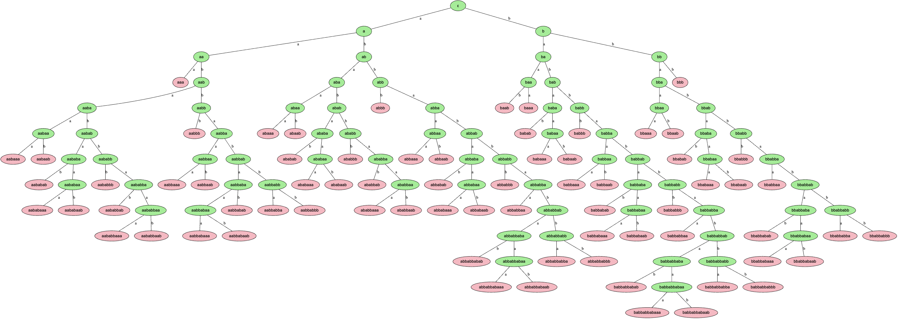
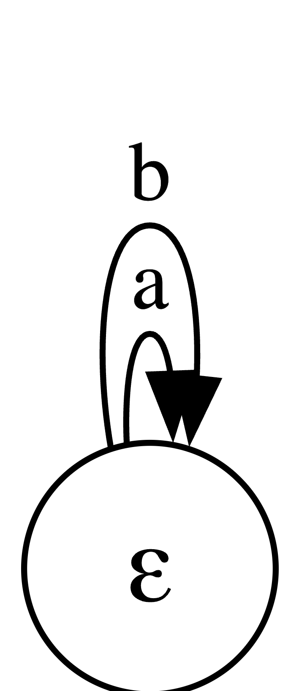
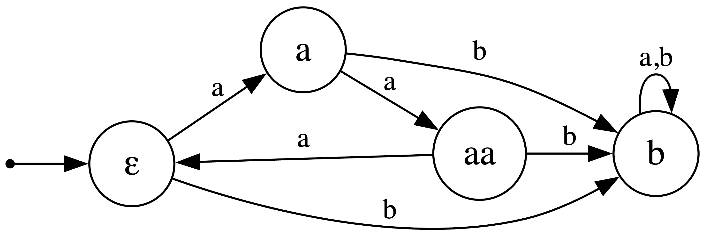

# Отчёт по lab1

## Задание

По имеющейся **SRS** требуется определить:

* **Завершимость**.
* **Конечность классов эквивалентности по НФ**
  (для эквивалентностей считаем, что правила применяются **в обе стороны**).
  Если классов конечное число — построить **минимальную** систему переписывания, им соответствующую.
* **Локальную конфлюэнтность** и **пополняемость по Кнуту–Бендиксу**.

---

## Исходная система правил (SRS)

```text
aaa → ε
bbb → bb
baab → baa
babab → aabab
bbaab → bbbab 
abaaab → baba
ababbab → ababaab
bbaaaab → ε
bbabbaa → bbaaa
aabbabba → bbaa
aabaababb → bbb
baababbaa → bbabbabba 
```

---

## 1) Завершимость

Нетерминируемость данной SRS доказывается одним конкретным **циклом** (значит существует бесконечное переписывание).

Используемые правила (оба сохраняют длину 5):

* `bbaab → bbbab`
* `babab → aabab`

Возьмём слово `abbaabab`. Тогда имеем 2-шаговый цикл:

```text
abbaabab  →  abbbabab (переписали подстроку bbaab → bbbab)
abbbabab  →  abbaabab (переписали суффикс babab → aabab)
```

После двух шагов мы вернулись к исходному слову `abbaabab`.
Следовательно, последовательность

```
abbaabab ⇒ abbbabab ⇒ abbaabab ⇒ abbbabab ⇒ …
```

Можно повторять бесконечно (после каждого полного прохода снова доступны те же два применения на тех же позициях).

**Вывод:** система переписывания **не терминируема (незавершаема)**.

---

## 2) Конечность классов эквивалентности по НФ

**Введём фундированный порядок shortlex (армейский):** сначала сравниваем длины, при равной длине — лексикографически (a<b).

**Ориентация правил под shortlex.** Используем следующий набор направлений (для убывания по shortlex два правила берём в обратную сторону относительно исходной SRS):

```
aaa → ε
bbb → bb
baab → baa
babab → aabab
bbbab → bbaab          // переориентация
abaaab → baba
ababbab → ababaab
bbaaaab → ε
bbabbaa → bbaaa
aabbabba → bbaa
aabaababb → bbb
bbabbabba → baababbaa  // переориентация
```

**Дерево-доказательство.** Построено порождающее дерево слов от ε: рёбра — дописывание `a`|`b`.
Раскраска: зелёные — НФ (ни одно ориентированное правило неприменимо), розовые листья — переписываются в уже встречавшиеся листья и не дают новых НФ.

На внешней границе дерева появляются только розовые листья — новых зелёных узлов нет. Следовательно, множество НФ **конечно**. Фактически получено **70** нормальных форм, значит и число классов эквивалентности по НФ конечно (равно 70).


---

# 3) Локальная конфлюэнтность и пополняемость (Кнут–Бендикс)

Берём фундированный порядок из п. 2.

## 3.1 Локальная конфлюэнтность: контрпример (до пополнения)

Есть незамыкаемый локальный пик из-за вложения `aaa` в `abaaab`:

```
abaaab ⇒ baba      (по abaaab→baba)
abaaab ⇒ abb       (по aaa→ε внутри abaaab)
```

`baba` и `abb` — короткие НФ и не сводятся друг к другу. Следовательно, система **локально не конфлюэнтна** без пополнений.

### 3.2 Пополняемость по Кнуту–Бендиксу

#### Критическая пара 1: правила `bbaaaab → ε` и `bbb → bb`

Базовое слово: `bbbaaaab`.
Две редукции:
1. Сначала сократить префикс `bbb → bb`, потом правило `bbaaaab → ε`:
```
bbbaaaab → bbaaaab → ε
```
2. Сразу сократить суффикс `bbaaaab → ε`:
```
bbbaaaab → b
```

Получаются разные результаты: `ε` и `b`. Чтобы они сходились, добавляем правило
```
b → ε
```

#### Критическая пара 2: правила `bbaaaab → ε` и `aaa → ε`  (с учётом добавленного `b → ε`)

Базовое слово: `bbaaaab`.
Две редукции:
1. Применить сразу `bbaaaab → ε`:
```
bbaaaab → ε
```
2. Сначала сократить вложение `aaa → ε`, затем удалить все оставшиеся `b` правилом `b → ε`:
```
bbaaaab → bbab → bab → ab → a
```

Снова разные результаты: `ε` и `a`. Чтобы их свести, добавляем правило
```
a → ε
```

С добавленными правилами `a → ε` и `b → ε` любое слово полностью сокращается до `ε`. Все остальные перекрытия автоматически сходятся к `ε`, т.е. локальная конфлюэнтность достигается.

#### SRS после пополнения

```
b → ε
a → ε
```

---

# 4) Минимальная система

После пополнения единственная НФ — `ε`. **Минимальная система** — просто:

```text
a → ε
b → ε
```



---

## 5) Инварианты  

При `bbaaaab → ε` инварианты тривиальны

Любая строка переписывается в `ε`. Любые содержательные инварианты становятся бессмысленными: нужный фрагмент можно занулить.

#### Исходная SRS (без `bbaaaab → ε`)

```
aaa         → ε
bbb         → bb
baab        → baa
babab       → aabab
bbbab       → bbaab
abaaab      → baba
ababbab     → ababaab
bbabbaa     → bbaaa
aabbabba    → bbaa
aabaababb   → bbb
bbabbabba   → baababbaa
```


#### Пополнение Кнута–Бендикса


1. aa**a**babbab  
   – (aaa→ε) → babbab  
   – (ababbab→ababaab) → babaa  
   -> **babbab → babaa**  

2. bbabb**aa**aa  
   – (aaa→ε) → bbabba  
   – (bbabbaa→bbaaa) → bbaa  
   -> **bbabba → bbaa**  

3. bbabb**aa**a  
   – (aaa→ε) → bbabb  
   – (bbabbaa→bbaaa) → bba  
   -> **bbabb → bba**  

4. aabbabb**a**aa  
   – (aaa→ε) → aabba  
   – (aabbabba→bbaa) → bba  
   -> **aabba → bba**  

5. aa**aa**bbabba  
   – (aaa→ε) → abbaa  
   – (aabbabba→bbaa) → bbaa  
   -> **abbaa → bbaa**  

6. bbabbabb**a**aa  
   – (aaa→ε) → bbaa  
   – (bbabbabba→baababbaa) → bba  
   -> **bbaa → bba**  

7. bb**b**aab  
   – (bbb→bb) → bbab  
   – (baab→baa) → bba  
   -> **bbab → bba**  

8. ababba**b**bb  
   – (bbb→bb) → ababba  
   – (ababbab→ababaab) → ababaa  
   -> **ababba → ababaa**  

9. bb**b**babbaa  
   – (bbb→bb) → bba  
   – (bbabbaa→bbaaa) → bb  
   -> **bba → bb**  

10. baa**b**aab  
    – (baab→baa первое вхождение) → bab  
    – (baab→baa второе вхождение) → ba  
    -> **bab → ba**  

11. baba**b**aab  
    – (baab→baa) → ba  
    – (babab→aabab) → aabb  
    -> **aabb → ba**  

12. baa**b**abab  
    – (baab→baa) → bb  
    – (babab→aabab) → baa  
    -> **baa → bb**  

13. ba**bab**ab  
    – (babab→aabab, вхождение 0..4) → ba (bab→ba, baab→baa, baa→bb, aabb→ba)  
    – (babab→aabab, вхождение 2..6) → bb (baa→bb, bba→bb, bbab→bba)  
    -> **bb → ba**  

14. ba**bab**ab  
    – (babab→aabab, вхождение 0..4) → ba (как в п.13)  
    – (babab→aabab, вхождение 2..6) → aaba (bababab → baaabab → baaaba → bbaba(baa→bb) → bbba(bba→bb) → bb → ba)  
    -> **aaba → ba**  

15. b**aa**a  
    – (aaa→ε) → b  
    – (baa→bb) → ba  
    -> **ba → b**  

16. aab**a**aa  
    – (aaa→ε) → aab  
    – (aaba→ba) → b  
    -> **aab → b**  

17. aa**aa**ba  
    – (aaa→ε) → ab  
    – (aaba→ba) → b  
    -> **ab → b**  


Пополенная система

```
babbab → babaa
bbabba → bbaa
bbabb → bba
aabba → bba
abbaa → bbaa
bbaa → bba
bbab → bba
ababba → ababaa
bba → bb
bab → ba
aabb → ba
baa → bb
bb → ba
aaba → ba
ba → b
aab → b
ab → b
```

#### Минимальная система переписывания


```
aaa → ε
ab  → b
ba  → b
bb  → b
```



#### Инварианты

1. Наличие `b` — если в слове есть хотя бы один `b`, его нельзя удалить полностью.
   `B(w) = min(1, |b|)`.

2. Остаток `|a| mod 3`, если `b` нет.
   Когда `b` появляется, всё сжимается в одно состояние.

3. Можно построить ДКА на 4 состояния:
   `E`, `A`, `AA`, `B` — соответствуют классам слов.

4. Матрицы над ℤ₇:

```
A = diag(2,1)
B = diag(0,1)
```

`A³ = I`, `B² = B`, `AB = BA = B`.
