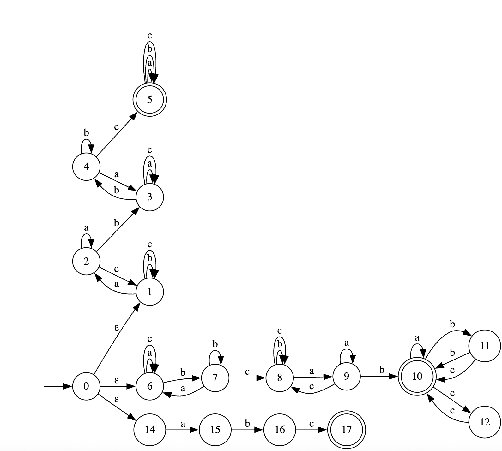
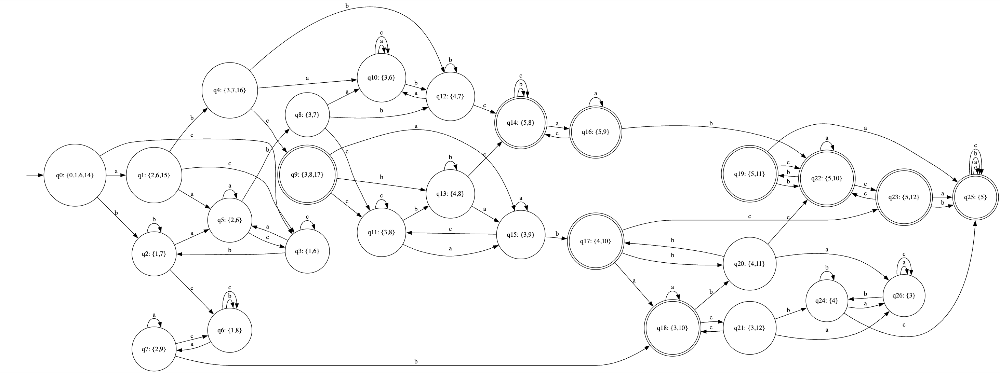
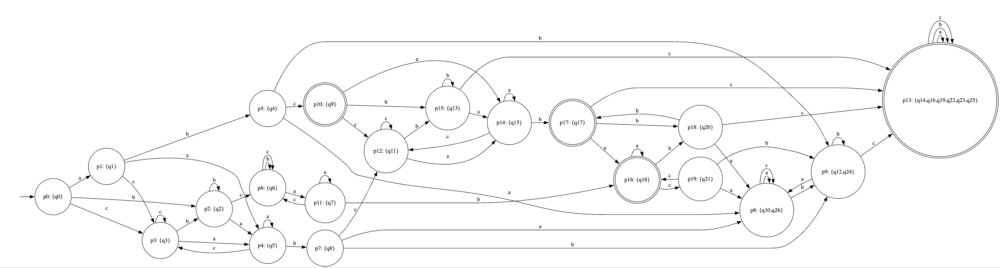

## НКА
Получившийся НКА лежит в файле nka.dot:

Таблица:
|       | ε  | b  | c  | ab | bc | abc | bbc | cab | abbc |
|-------|----|----|----|----|----|-----|-----|-----|------|
| abc   | 1  | 0  | 0  | 1  | 1  | 1   | 1   | 1   | 1    |
| bca   | 0  | 1  | 0  | 1  | 0  | 0   | 1   | 1   | 1    |
| ab    | 0  | 0  | 1  | 0  | 1  | 1   | 1   | 1   | 1    |
| bc    | 0  | 0  | 0  | 1  | 0  | 0   | 0   | 1   | 1    |
| a     | 0  | 0  | 0  | 0  | 1  | 0   | 1   | 0   | 1    |
| ε     | 0  | 0  | 0  | 0  | 0  | 1   | 0   | 0   | 1    |
| aa    | 0  | 0  | 0  | 0  | 0  | 0   | 1   | 0   | 1    |
| b     | 0  | 0  | 0  | 0  | 0  | 0   | 0   | 1   | 1    |
| c     | 0  | 0  | 0  | 0  | 0  | 0   | 0   | 0   | 1    |

---

## ДКА
Получившийся ДКА лежит в файле dka.dot:
Состояние записано как (q0: {0,1,6,14}), где q0 - название состояние в ДКА, а {0,1,6,14} - состояние из НКА

## Минимальный ДКА
Получившийся минимальный ДКА лежит в файле min_dka.dot:
Состояние записано как (p0: {q12,q24}), где p0 - название состояние в мин. ДКА, а {q12,q24} - состояние из ДКА

В результате получаются 20 классов эквивалентности:

* `p0  = {q0}`
* `p1  = {q1}`
* `p2  = {q2}`
* `p3  = {q3}`
* `p4  = {q5}`
* `p5  = {q4}`
* `p6  = {q6}`
* `p7  = {q8}`
* `p8  = {q10, q26}`
* `p9  = {q12, q24}`
* `p10 = {q9}`
* `p11 = {q7}`
* `p12 = {q11}`
* `p13 = {q14, q16, q19, q22, q23, q25}`
* `p14 = {q15}`
* `p15 = {q13}`
* `p16 = {q18}`
* `p17 = {q17}`
* `p18 = {q20}`
* `p19 = {q21}`

1. Среди принимающих:
   * из `q14, q16, q19, q22, q23, q25` по любой букве автомат остаётся внутри этого же множества и никогда не попадает в непринимающее состояние -> из каждого такого состояния принимаются все слова -> у них одинаковый остаточный язык. Это класс `p13`.
   * `q9`, `q17`, `q18` ведут себя по-другому (например, из `q9` по `c` попадаем в непринимающее, из `q14` по `c` остаёмся в принимающем и т.д.), поэтому каждый из них образует свой класс: `p10`, `p17`, `p16`.

2. Среди непринимающих:
   * `q10` и `q26` симметричны: по `a` и `c` зацикливаются внутри пары, по `b` оба идут в пару `{q12,q24}`. Любой суффикс даёт одинаковый результат -> один класс `p8`.
   * `q12` и `q24` тоже эквивалентны: по `a` -> `{q10,q26}`, по `b` зацикливаются, по `c` -> большой принимающий блок. Это класс `p9`.
   * остальные состояния по структуре переходов отличимы от всех других (каким-то суффиксом их можно добить до разных принимающих / непринимающих). В итоге остаётся ровно 20 разных классов - `p0..p19`.

Таблица, доказывающая минимальность

|| ε | a | ab | abc | b | bbc | bc | c | ca | cab | cb |
|-------|---|---|---|---|---|---|---|---|---|---|---|
| ε     | 0 | 0 | 0 | 1 | 0 | 0 | 0 | 0 | 0 | 0 | 0 |
| a     | 0 | 0 | 0 | 0 | 0 | 1 | 1 | 0 | 0 | 0 | 0 |
| b     | 0 | 0 | 0 | 0 | 0 | 0 | 0 | 0 | 0 | 1 | 0 |
| c     | 0 | 0 | 0 | 0 | 0 | 0 | 0 | 0 | 0 | 0 | 0 |
| aa    | 0 | 0 | 0 | 0 | 0 | 1 | 0 | 0 | 0 | 0 | 0 |
| ab    | 0 | 0 | 0 | 1 | 0 | 1 | 1 | 1 | 0 | 1 | 0 |
| bc    | 0 | 0 | 1 | 0 | 0 | 0 | 0 | 0 | 0 | 1 | 0 |
| aab   | 0 | 0 | 0 | 1 | 0 | 1 | 1 | 0 | 0 | 1 | 0 |
| aba   | 0 | 0 | 0 | 1 | 0 | 1 | 1 | 0 | 0 | 0 | 0 |
| abb   | 0 | 0 | 0 | 1 | 0 | 1 | 1 | 1 | 1 | 1 | 1 |
| abc   | 1 | 0 | 1 | 1 | 0 | 1 | 1 | 0 | 0 | 1 | 0 |
| bca   | 0 | 0 | 1 | 0 | 1 | 1 | 0 | 0 | 0 | 1 | 0 |
| aabc  | 0 | 0 | 1 | 1 | 0 | 1 | 1 | 0 | 0 | 1 | 0 |
| abbc  | 1 | 1 | 1 | 1 | 1 | 1 | 1 | 1 | 1 | 1 | 1 |
| abca  | 0 | 0 | 1 | 1 | 1 | 1 | 1 | 0 | 0 | 1 | 0 |
| abcb  | 0 | 0 | 1 | 1 | 0 | 1 | 1 | 1 | 1 | 1 | 1 |
| bcab  | 1 | 1 | 0 | 1 | 0 | 1 | 1 | 0 | 0 | 0 | 0 |
| abcab | 1 | 1 | 0 | 1 | 0 | 1 | 1 | 1 | 1 | 1 | 1 |
| bcabb | 0 | 0 | 0 | 1 | 1 | 1 | 1 | 1 | 1 | 1 | 1 |
| bcabc | 0 | 0 | 0 | 1 | 0 | 1 | 1 | 1 | 1 | 0 | 0 |

---

## Расширенная регулярка

