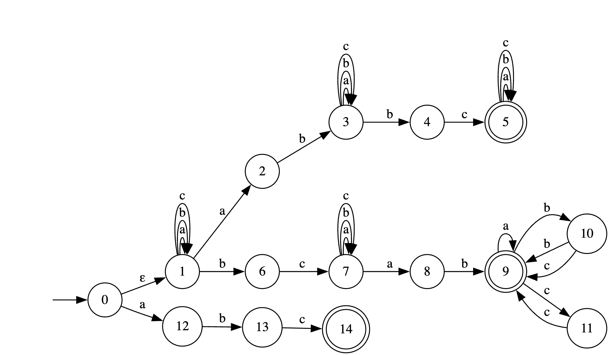
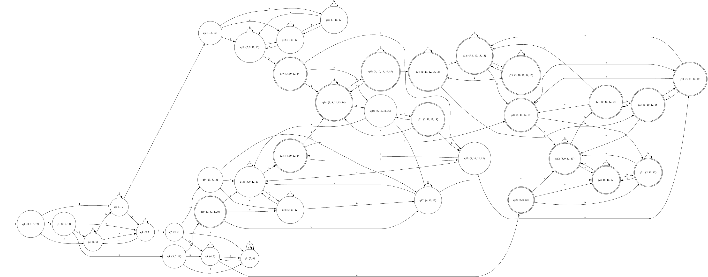
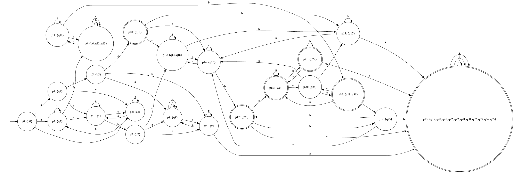
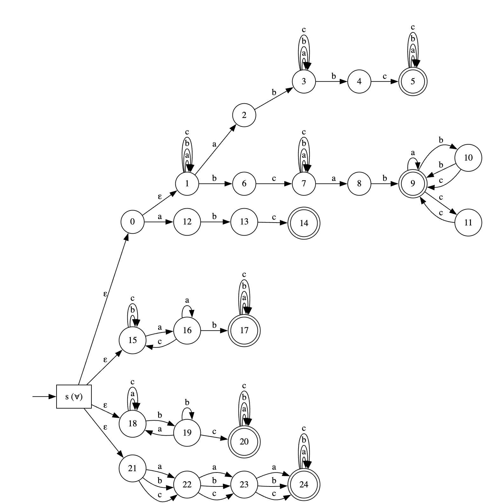

## НКА
Получившийся НКА лежит в файле nfa.dot:



Таблица:
|      |  c | ε  | b | bc | ab | abc | cab | bbc |
|------|----|----|---|----|----|-----|-----|-----|
| abb  |  1 | 0  | 0 | 1  | 0  | 1   | 1   | 1   |
| abc  |  0 | 1  | 0 | 1  | 1  | 1   | 1   | 1   |
| bca  |  0 | 0  | 1 | 0  | 1  | 0   | 1   | 1   |
| aab  |  0 | 0  | 0 | 1  | 0  | 1   | 1   | 1   |
| bc   |  0 | 0  | 0 | 0  | 1  | 0   | 1   | 0   |
| ε    |  0 | 0  | 0 | 0  | 0  | 1   | 0   | 0   |
| b    |  0 | 0  | 0 | 0  | 0  | 0   | 1   | 0   |
| aa   |  0 | 0  | 0 | 0  | 0  | 0   | 0   | 1   |

---

## ДКА

Получившийся ДКА лежит в файле dfa.dot:

Состояние записано как (q0: {0,1,6,17}), где q0 - название состояния в ДКА, а {0,1,6,17} - состояния из НКА


## Минимальный ДКА
Получившийся минимальный ДКА лежит в файле min_dfa.dot:

Состояние записано как (p0: {q6, q12, q13}), где p0 - название состояния в мин. ДКА, а {q6, q12, q13} - состояния из ДКА


В результате получаются 22 класса эквивалентности:

* `p0  = {q0}`
* `p1  = {q1}`
* `p2  = {q2}`
* `p3  = {q3}`
* `p4  = {q4}`
* `p5  = {q5}`
* `p6  = {q6, q12, q13}`
* `p7  = {q7}`
* `p8  = {q8}`
* `p9  = {q9}`
* `p10 = {q10}`
* `p11 = {q11}`
* `p12 = {q14, q18}`
* `p13 = {q15, q20, q21, q22, q27, q28, q30, q32, q33, q34, q35}`
* `p14 = {q16}`
* `p15 = {q17}`
* `p16 = {q19, q31}`
* `p17 = {q23}`
* `p18 = {q24}`
* `p19 = {q25}`
* `p20 = {q26}`
* `p21 = {q29}`


1. Среди принимающих:

  * `p13 = {q15, q20, q21, q22, q27, q28, q30, q32, q33, q34, q35}`  
    Это большой поглощающий блок: по любой букве автомат остаётся внутри этого же множества и никогда не попадает в непринимающее состояние.  
    Значит, из каждого такого состояния принимаются все слова, остаточные языки совпадают -> это один класс `p13`.

  * `p16 = {q19, q31}`  
    У состояний `q19` и `q31` одинаковое поведение:
    - по `a` из обоих автомат переходит в `q24`,
    - по `b` - в `q25`,
    - по `c` - в `q26`.
    При этом `q24`, `q25`, `q26` однозначно попадают в классы `p18`, `p19`, `p20`,  
    и дальнейшие переходы из этих классов одинаковы для обоих случаев.
    Значит, для любого суффикса слово будет приниматься/отвергаться одновременно из `q19` и из `q31`: суффиксом нельзя различить эти два состояния. Поэтому они имеют один и тот же остаточный язык и попадают в один класс эквивалентности `p16`.


2. Среди непринимающих:

  * `p6 = {q6, q12, q13}`  
    У этих трёх одинаковые переходы по всем символам:
    - по `a` все идут в один и тот же класс (`p11`),
    - по `b` все остаются внутри `p6`,
    - по `c` тоже остаются внутри `p6`.
    Любой суффикс продолжает эту симметрию -> один остаточный язык.

  * `p12 = {q14, q18}`  
    `q14` и `q18` симметричны: по `a`, `b`, `c` попадают в одни и те же классы (в `p12` или в те же принимающие классы). Поэтому это один класс.


Таблица, доказывающая минимальность

| | bc | abc | cab | ab | bbc | c | ca | ε | a | b | ac | cb |
|---------|----|-----|-----|----|-----|---|----|---|---|---|----|----|
| ε       | 0  | 1   | 0   | 0  | 0   | 0 | 0  | 0 | 0 | 0 | 0  | 0  |
| a       | 1  | 0   | 0   | 0  | 1   | 0 | 0  | 0 | 0 | 0 | 0  | 0  |
| b       | 0  | 0   | 1   | 0  | 0   | 0 | 0  | 0 | 0 | 0 | 0  | 0  |
| c       | 0  | 0   | 0   | 0  | 0   | 0 | 0  | 0 | 0 | 0 | 0  | 0  |
| aa      | 0  | 0   | 0   | 0  | 1   | 0 | 0  | 0 | 0 | 0 | 0  | 0  |
| ab      | 1  | 1   | 1   | 0  | 1   | 1 | 0  | 0 | 0 | 0 | 0  | 0  |
| bc      | 0  | 0   | 1   | 1  | 0   | 0 | 0  | 0 | 0 | 0 | 0  | 0  |
| aab     | 1  | 1   | 1   | 0  | 1   | 0 | 0  | 0 | 0 | 0 | 0  | 0  |
| aba     | 1  | 1   | 0   | 0  | 1   | 0 | 0  | 0 | 0 | 0 | 0  | 0  |
| abb     | 1  | 1   | 1   | 0  | 1   | 1 | 1  | 0 | 0 | 0 | 0  | 1  |
| abc     | 1  | 1   | 1   | 1  | 1   | 0 | 0  | 1 | 0 | 0 | 0  | 0  |
| bca     | 0  | 0   | 1   | 1  | 1   | 0 | 0  | 0 | 0 | 1 | 0  | 0  |
| aabc    | 1  | 1   | 1   | 1  | 1   | 0 | 0  | 0 | 0 | 0 | 0  | 0  |
| abbc    | 1  | 1   | 1   | 1  | 1   | 1 | 1  | 1 | 1 | 1 | 1  | 1  |
| abca    | 1  | 1   | 1   | 1  | 1   | 0 | 0  | 0 | 0 | 1 | 0  | 0  |
| abcb    | 1  | 1   | 1   | 1  | 1   | 1 | 1  | 0 | 0 | 0 | 0  | 1  |
| bcab    | 1  | 1   | 1   | 1  | 1   | 0 | 0  | 1 | 1 | 0 | 0  | 0  |
| abcab   | 1  | 1   | 1   | 1  | 1   | 1 | 1  | 1 | 1 | 0 | 0  | 1  |
| bcaba   | 1  | 1   | 1   | 1  | 1   | 0 | 0  | 1 | 1 | 1 | 0  | 0  |
| bcabb   | 1  | 1   | 1   | 1  | 1   | 1 | 1  | 0 | 0 | 1 | 0  | 1  |
| bcabc   | 1  | 1   | 1   | 1  | 1   | 1 | 1  | 0 | 0 | 0 | 0  | 0  |
| bcabab  | 1  | 1   | 1   | 1  | 1   | 1 | 1  | 1 | 1 | 1 | 0  | 1  |


## ПКА
Так как любое слово из нашего языка обязательно содержит подслово ab, то я взял исходный НКА и добавил маленький автомат, проверяющий свойство "в слове есть ab", и соединил их через одно универсальное состояние s.

Получившийся ПКА лежит в файле afa.dot:


Таблица:
| |   ε   |  bc | bbc |
|---------|----|-----|-----|
| a    |   0    |   1   |   1   |
| aa   |   0    |   0   |   1   |
| bc   |   0    |   0   |   0   |


---

## Расширенная регулярка
```
^(?=[abc]*$)(?:.*ab.*bc.*|.*bc.*ab(?:a|bc|cc|bb)*|abc)$
```

---

Фазз-тестирование находится в папке fuzzing